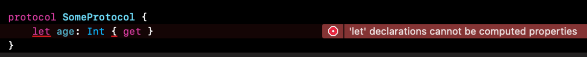

# 1.协议&泛型

`协议`为`方法`、`属性`、以及其他特定的任务需求或功能定义蓝图。协议可被类、结构体、或枚举类型采纳以提供所需功能的具体实现。满足了协议中需求的任意类型都叫做遵循了该协议。 除了指定遵循类型必须实现的要求外，可以扩展一个协议以实现其中的一些需求或实现一个符合类型的可以利用的附加功能。

## 1.基本语法

### 1.1语法格式

```swift
protocol SomeProtocol {
    // protocol definition goes here
}
```

`class`，`struct`，`enum`都可以遵循协议，如果要遵守多个协议，使用逗号分隔

```swift
struct SomeStructure: FirstProtocol, AnotherProtocol {
    // structure definition goes here
}
```

父类名放在遵循的协议名之前，用逗号隔开

```swift
class SomeClass: SomeSuperclass, FirstProtocol, AnotherProtocol {
    // class definition goes here
}
```

### 1.2属性

协议要求一个属性必须明确是可读或可读写的；



`遵循协议`的类型只要包含协议规定的读写属性就可以，比如协议规定`属性`是可读的，遵循的类型可以声明为读写的，反之不行。

* 属性要求定义为变量类型；


* 协议要求遵循该协议的类型提供特定名字和类型的实例属性或类型属性（并不具体说明是存储属性还是计算属性，只要求有特定的名称和类型）；

```swift
protocol SomeProtocol {
    static var name: String {get}
    var age: Int { get set}
}

struct Hotpot: SomeProtocol {
    static var name: String {
        get {
            "hotpot"
        }
    }
    
    var age: Int = 18
}

struct Cat: SomeProtocol {
    var myAge: Int
    static var name: String  = "hotpot"
    var age: Int {
        get {
            18
        }
        set {
            myAge = newValue + 1
        }
    }
}
```

### 1.3方法

`协议`中可以定义`实例方法`和`类方法`，只需要定义当前方法的名称，参数列表和返回值，不需要大括号和方法的主体。

```swift
protocol SomeProtocol {
    func something() -> String
    static func doSomething()
    func myThing()
}

extension SomeProtocol {
    func something() -> String {
        return "something"
    }
    
    static func doSomething() {
        print("doSomething")
    }
}

struct Hotpot: SomeProtocol {
    func myThing() {
        print("myThing")
    }
}

var hotpot = Hotpot()

Hotpot.doSomething()
hotpot.something()
hotpot.myThing()
```

* 在协议的定义中，**方法参数不能定义默认值**；


* 协议中定义初始化方法，在类中实现初始化器的时候必须使用`required`关键字\(`final`类除外\)；

> 由于 `final` 的类不会有子类，如果协议初始化器实现的类使用了 `final` 标记，就不需要使用 `required` 来修饰了。因为这样的类不能被继承。


* 协议要求只被能类遵循，加上`AnyObject`；


```swift
protocol SomeProtocol {
    init(age: Int)
}

struct Hotpot: SomeProtocol {
    var age: Int
    init(age: Int) {
        self.age = age
    }
}

class Cat: SomeProtocol {
    var age: Int
    required init(age: Int) {
        self.age = age
    }
}
```


## 2.协议作为类型

* 作为函数、方法或初始化程序中的参数类型或返回类型；
* 作为常量、变量或属性的类型；
* 作为数组、字典或其他容器中项目的类型

